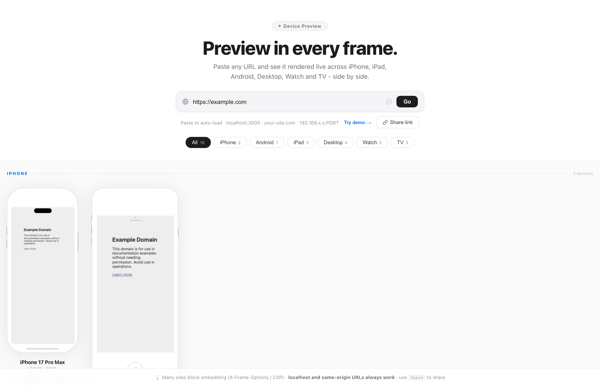
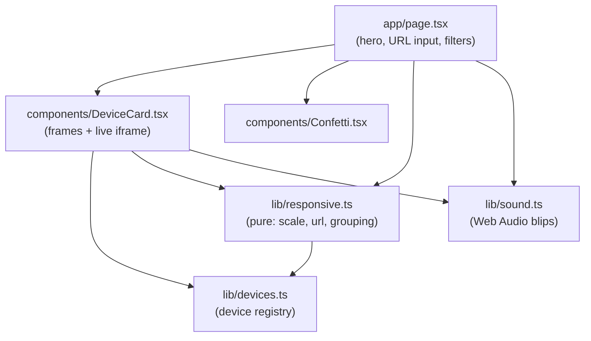

# Responsiveness

Paste any URL and see it rendered **live** across real device frames - iPhone, iPad,
Android, Desktop, Apple Watch, and Smart TV - side by side. A fast, static, client-only
responsive previewer.



## Features

- **15 device frames** across 6 categories - iPhone (Dynamic Island + Touch ID), Android
  (Pixel), iPad, Desktop (iMac + 1080p/2K/4K monitors), Apple Watch, and Smart TV, each
  drawn to its real viewport and aspect.
- **Live iframes** - the target URL loads inside every frame at once, scaled to fit.
- **Category filters** with device counts, and a grouped "All" view.
- **Deep links** - `?url=` loads a site on open, so previews are shareable and
  agent-callable. A one-tap "Share link" copies it.
- **Paste to auto-load** - paste a URL anywhere and it loads.
- Playful touches: hover glow + spec chips (resolution, ratio, screen, PPI), and a
  confetti + chime when a site actually renders.

> Many sites block embedding via `X-Frame-Options` / `Content-Security-Policy`; those
> show a "Blocked by site" card. `localhost` and same-origin URLs always render.

## Stack

Next.js 16 (App Router) · React 19 · TypeScript · Vitest + Playwright. No runtime
dependencies beyond React - inline styles and the Web Audio API only.

## Architecture

Fully client-side and static - no backend, no runtime env. Pure logic is isolated and
unit-tested; the page just composes components.



- `lib/responsive.ts` - pure functions (`getScale`, `normalizeUrl`, `groupDevices`, ...).
  No React, unit-tested with Vitest.
- `lib/devices.ts` - the device registry (data only).
- `components/DeviceCard.tsx` - the per-device frame + scaled live iframe.
- `next.config.ts` - security headers; `frame-src` is intentionally open (the app's whole
  job is embedding arbitrary URLs), but the app itself is never framable.

## Develop

```bash
npm install
npm run dev            # http://localhost:3021

npm run typecheck      # tsc --noEmit
npm run lint           # eslint (flat config + jsx-a11y)
npm run format:check   # prettier
npm test               # vitest unit tests
npm run test:e2e       # playwright end-to-end
```

A Husky pre-push hook runs typecheck + lint + format + unit tests; GitHub Actions runs
the full gate (format, typecheck, lint, unit, build, prod audit, e2e) on every push/PR.

## License

[MIT](LICENSE)
