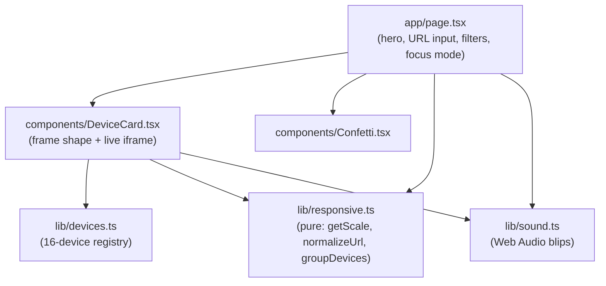

<div align="center">

# Responsiveness

**Preview any URL across real device frames.**

[](LICENSE)


[Live demo](https://responsiveness-bheng.vercel.app)


</div>

Paste a URL and it renders **live**, at once, inside 16 real device frames - iPhone, Android,
iPad, Desktop, Apple Watch, and Smart TV - each drawn to its true viewport and aspect ratio. No
backend, no build step for the target site: it's just an `<iframe>` per device, scaled to fit.

## Features

- **16 device frames across 6 categories** - iPhone (Dynamic Island + a Touch ID home-button
  model), Pixel/Android, iPad, Desktop (iMac + 1080p/2K/4K monitors), Apple Watch, and Smart TV.
- **Live, simultaneous iframes** - the target URL loads in every visible frame, scaled to fit;
  frames stay idle until a device is actually opened so the landing page doesn't hammer one site
  with a burst of requests.
- **Category filters** with live device counts, plus a grouped "All" view.
- **Deep links** - `?url=` loads a site on open, so a preview is shareable and agent-callable.
  A one-tap "Share link" button copies the current link.
- **Paste to auto-load** - paste a URL anywhere on the page and it loads immediately.
- **Immersive focus mode** - click any frame to blow it up center-stage, auto-scaled to the
  viewport (Escape or click-outside to close).
- **Blocked-site detection** - a frame that hasn't loaded within 5s (common with
  `X-Frame-Options` / CSP) shows a "Blocked by site" card instead of hanging forever.
- **Mobile-aware layout** - under 640px the grid collapses to a single device picked from a
  dropdown instead of 16 cramped frames.
- **Playful touches** - hover glow + spec chips (resolution, aspect ratio, screen size, PPI), a
  confetti burst, and a Web Audio chime the first time a site actually renders.

## How it works

The app is fully client-side and static - no backend, no database, no runtime env vars.
`app/page.tsx` owns the interaction state (active URL, category filter, focused device) and
composes `DeviceCard`, which picks one of five frame shapes - phone, tablet, desktop, watch, TV -
around a lazily-loaded `<iframe>`. All scaling, URL normalization, and device grouping is pure,
framework-free logic in `lib/responsive.ts`, unit-tested in isolation from React.


```mermaid
flowchart TD
    Page["app/page.tsx<br/>(hero, URL input, filters, focus mode)"]
    Card["components/DeviceCard.tsx<br/>(frame shape + live iframe)"]
    Confetti["components/Confetti.tsx"]
    Devices["lib/devices.ts<br/>(16-device registry)"]
    Resp["lib/responsive.ts<br/>(pure: getScale, normalizeUrl, groupDevices)"]
    Sound["lib/sound.ts<br/>(Web Audio blips)"]

    Page --> Card
    Page --> Confetti
    Page --> Resp
    Page --> Sound
    Card --> Devices
    Card --> Resp
    Card --> Sound
```

> Many sites block embedding via `X-Frame-Options` / `Content-Security-Policy`; those show a
> "Blocked by site" card after a 5s timeout. `localhost` and same-origin URLs always render.
> `next.config.ts` deliberately leaves `frame-src` open - embedding arbitrary URLs is the app's
> whole job - while keeping the app itself unframable (`frame-ancestors 'none'`).

## Device presets

| Category | Devices |
|---|---|
| iPhone | 17 Pro Max, 5s |
| Android | Pixel XL 2 |
| iPad | mini M5, Pro M5 11″, Pro M5 13″ |
| Desktop | iMac 24″, 1080p / 2K / 4K monitor |
| Watch | Ultra 2, Series 10 46mm, SE 44mm |
| TV | Samsung Frame 4K 70″, Sony Bravia 85″ XR, LG OLED 8K 65″ |

## Tech stack

| Layer | Choice |
|---|---|
| Framework | Next.js 16 (App Router) |
| UI | React 19, TypeScript (strict), inline styles - no CSS framework |
| Audio | Web Audio API (no assets) |
| Unit tests | Vitest |
| E2E tests | Playwright |
| Lint / format | ESLint (flat config + jsx-a11y) + Prettier |
| Git hooks | Husky - pre-push runs typecheck, lint, format check, and unit tests |
| CI | GitHub Actions - format, typecheck, lint, unit, build, prod audit, e2e on every push/PR |
| Hosting | Vercel |

## Getting started

```bash
git clone https://github.com/bunlongheng/responsiveness.git
cd responsiveness
npm install
npm run dev            # http://localhost:3021
```

```bash
npm run typecheck      # tsc --noEmit
npm run lint            # eslint (flat config + jsx-a11y)
npm run format:check   # prettier --check .
npm test               # vitest unit tests
npm run test:e2e       # playwright end-to-end
```

## License

[MIT](LICENSE)

---

<p align="center">
  <sub>Built by <a href="https://bunlongheng.com">Bunlong Heng</a> &middot; <a href="https://bunlongheng.com/projects/responsiveness">See it in my portfolio &rarr;</a></sub>
</p>

---

<div align="center">

<a href="https://bunlongheng.com"></a>
<a href="https://www.linkedin.com/in/bunlongheng/"></a>
<a href="https://www.instagram.com/ibunlong/"></a>
<a href="mailto:bheng.code@gmail.com"></a>

<br>

Built by **[Bunlong](https://bunlongheng.com)** &nbsp;&middot;&nbsp; [more apps](https://bunlongheng.com/projects)

</div>
